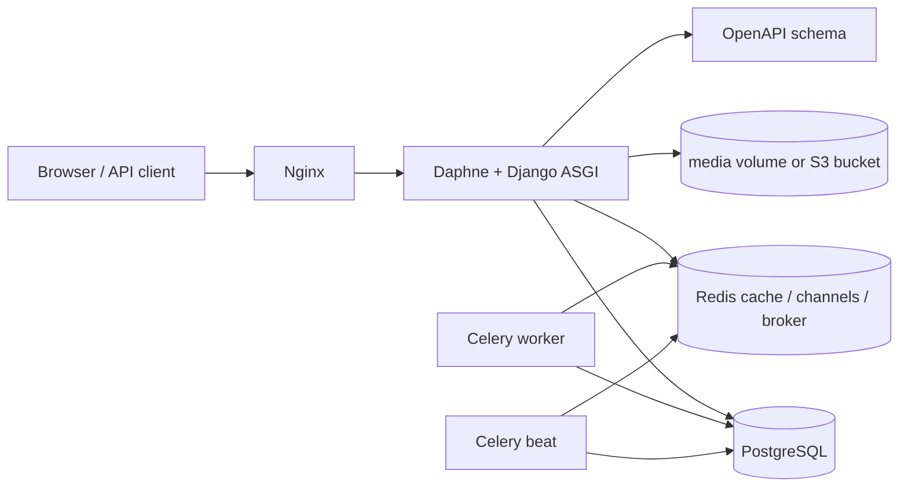

# n-feed

[](https://github.com/naevor/n-feed/actions/workflows/ci.yml)

n-feed is a Django Twitter-style backend project with server-rendered pages, a versioned REST API, JWT auth, hashtags, real-time notifications, tests, CI, and Docker-ready production settings.

## Stack

- Django 5.2
- Django REST Framework
- Simple JWT
- Channels and Daphne
- Celery and django-celery-beat
- drf-spectacular OpenAPI docs
- PostgreSQL or SQLite
- Redis cache
- django-storages with optional S3-compatible media storage
- pytest, ruff, pre-commit
- Docker Compose with PostgreSQL, Redis, MinIO, Daphne, Celery, Nginx

## Architecture



The Django app serves HTML pages, REST API endpoints, and websocket consumers from the same ASGI process. Shared business rules live in services and selectors, so templates, API viewsets, signals, and Celery tasks call the same project logic instead of duplicating mutations or feed queries.

## Local Development

```powershell
python -m venv .venv
.\.venv\Scripts\Activate.ps1
pip install -r requirements-dev.txt
Copy-Item .env.example .env
python manage.py migrate
python manage.py runserver
```

The local default uses SQLite. Set `DB_ENGINE=postgres` and the `POSTGRES_*` variables in `.env` to use PostgreSQL.

## Docker Quickstart

```powershell
docker compose --env-file .env.example up --build
```

Open `http://127.0.0.1:8000/`.

Using `.env.example` for Compose avoids accidental interpolation of special characters from a local Django `.env` secret.

Seed demo data:

```powershell
docker compose exec web python manage.py seed_demo --users=20 --tweets=200 --reset
```

Useful endpoints:

- `GET /healthz/`
- `GET /readyz/`
- `GET /celeryz/`
- `GET /api/docs/`
- `GET /api/redoc/`
- `GET /api/v1/tweets/`
- `GET/PATCH /api/v1/users/me/`
- `GET /api/v1/tags/trending/`
- `WS /ws/notifications/`
- `WS /ws/feed/`

## API Examples

Login and call authenticated endpoints:

```powershell
$base = "http://127.0.0.1:8000"
$login = Invoke-RestMethod `
  -Method Post `
  -Uri "$base/api/v1/auth/login/" `
  -ContentType "application/json" `
  -Body (@{ username = "author"; password = "testpass123" } | ConvertTo-Json)
$headers = @{ Authorization = "Bearer $($login.access)"; "X-Request-ID" = "manual-smoke-1" }
Invoke-RestMethod "$base/api/v1/users/me/" -Headers $headers
```

Create a tweet, then toggle like/bookmark:

```powershell
$tweet = Invoke-RestMethod `
  -Method Post `
  -Uri "$base/api/v1/tweets/" `
  -Headers $headers `
  -ContentType "application/json" `
  -Body (@{ content = "API smoke #django" } | ConvertTo-Json)
Invoke-RestMethod -Method Post -Uri "$base/api/v1/tweets/$($tweet.slug)/like/" -Headers $headers
Invoke-RestMethod -Method Post -Uri "$base/api/v1/tweets/$($tweet.slug)/bookmark/" -Headers $headers
```

Upload media through multipart form data:

```powershell
$form = @{
  content = "tweet with media"
  media = Get-Item ".\sample.gif"
}
Invoke-RestMethod -Method Post -Uri "$base/api/v1/tweets/" -Headers $headers -Form $form
```

Connect to realtime notifications from browser code after logging in through the web session:

```javascript
const socket = new WebSocket("ws://127.0.0.1:8000/ws/notifications/");
socket.onmessage = (event) => console.log(JSON.parse(event.data));
```

Docker Compose starts the web process, a Celery worker, and Celery beat. The web container runs migrations and creates the default periodic task that removes old notifications.

Uploads are intentionally limited: avatars accept GIF/JPEG/PNG/WebP up to 2 MB, and tweet media accepts the same image types up to 5 MB. Override `MAX_AVATAR_UPLOAD_SIZE` and `MAX_TWEET_MEDIA_UPLOAD_SIZE` through the environment if production limits need to differ.
Avatar and tweet uploads generate WebP thumbnails asynchronously through Celery. Local development runs that task eagerly by default, while Docker/prod sends it through Redis to the worker. API responses expose both original media and thumbnail URLs plus processing status.
Replaced avatars, deleted tweet media, and their thumbnails are removed from storage automatically. To inspect or delete orphaned files under managed media folders, run `python manage.py cleanup_orphan_media` or `python manage.py cleanup_orphan_media --delete`.
Responses include an `X-Request-ID` header. Pass your own `X-Request-ID` from an API client to correlate request logs; otherwise the app generates one.

Docker Compose also starts MinIO on `http://127.0.0.1:9001/` for S3-compatible testing. Files still use the local media volume unless `USE_S3_STORAGE=True` is set. For MinIO, use the `AWS_*` variables from `.env.example`; for a real provider, set the same variables with the provider endpoint or leave `AWS_S3_ENDPOINT_URL` empty for AWS S3.

For local development without Redis, Celery tasks run eagerly by default through `CELERY_TASK_ALWAYS_EAGER=True`.
If you want to test the real queue locally, run Redis and set:

```powershell
$env:CELERY_TASK_ALWAYS_EAGER="False"
$env:CELERY_BROKER_URL="redis://localhost:6379/0"
celery -A twitmain worker -l info
celery -A twitmain beat -l info --scheduler django_celery_beat.schedulers:DatabaseScheduler
```

## Production Notes

Use `DJANGO_ENV=prod`, PostgreSQL, Redis, and a real reverse proxy with HTTPS. Start the web process with Daphne because the project uses websocket consumers.

Required production steps:

1. Set all variables from `.env.production.example`.
2. Run `python manage.py migrate --noinput`.
3. Run `python manage.py collectstatic --noinput`.
4. Run `python manage.py configure_periodic_tasks`.
5. Start Daphne, one Celery worker, and Celery beat.
6. Point the load balancer health check at `/readyz/`.

`/healthz/` only confirms that Django can return a response. `/readyz/` checks the database, cache, and Channels layer, so it is the endpoint to use before sending traffic to a web container. `/celeryz/` checks Celery worker visibility separately; it is intentionally not part of web readiness to avoid startup dependency cycles.

## Checks

```powershell
.\.venv\Scripts\python.exe manage.py check
.\.venv\Scripts\pytest.exe
.\.venv\Scripts\ruff.exe check .
.\.venv\Scripts\pre-commit.exe run --all-files
.\.venv\Scripts\python.exe manage.py collectstatic --dry-run --noinput --verbosity 0
```

## Settings

Settings are split by environment:

- `twitmain.settings.dev` for local development
- `twitmain.settings.prod` for container/production runtime
- `twitmain.settings` switches based on `DJANGO_ENV=dev|prod`

Production requires `DJANGO_SECRET_KEY` and `DJANGO_ALLOWED_HOSTS`. Docker Compose provides local-safe defaults and disables HTTPS-only cookie behavior so the app works over local HTTP.
